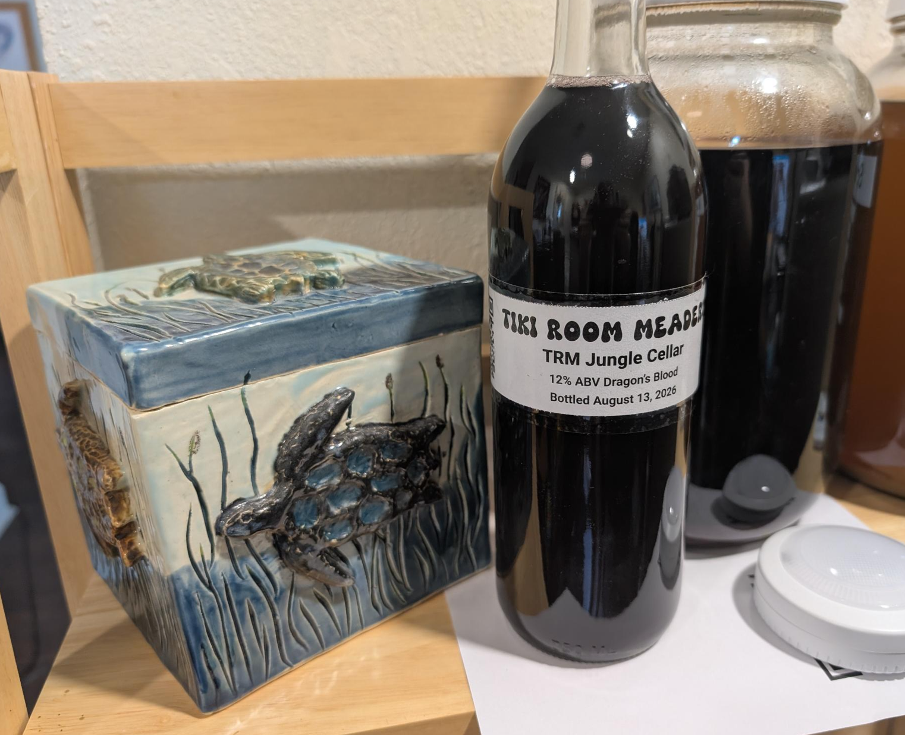

[← Back to 2026 Batches](../)

## Overview

| | |
|---|---|
| **Type** | Dragon's Blood |
| **Start date** | June 4, 2026 |
| **Bottling date** | August 13, 2026 |
| **ABV** | 12% |

[Print label](../../print/?batch=2026/TRM%20Jungle%20Cellar) &middot; [Edit on GitHub](https://github.com/Tehtsuo/Mead/edit/main/2026/TRM%20Jungle%20Cellar/index.md) &middot; [View live page](https://tehtsuo.github.io/Mead/2026/TRM%20Jungle%20Cellar/)

## Recipe

- Honey: 3 lbs Kirkland Wildflower
- Water: Fill to 1 gallon
- Yeast: Lalvin 71B
- Nutrient: Fermaid-o
- Earl Grey Tea
   
## Gravity & Fermentation Log

* June 15, 2026 :  1.030
* June 23, 2026 :  1.020
* August 1, 2026 :  1.020
* August 13, 2026 : 1.016

## Brewing Notes

- June 23, 2026 : Racked, added 4 pounds of 3 berry mix
- August 13, 2026 : Backsweetened to 1.056

## Bottled

